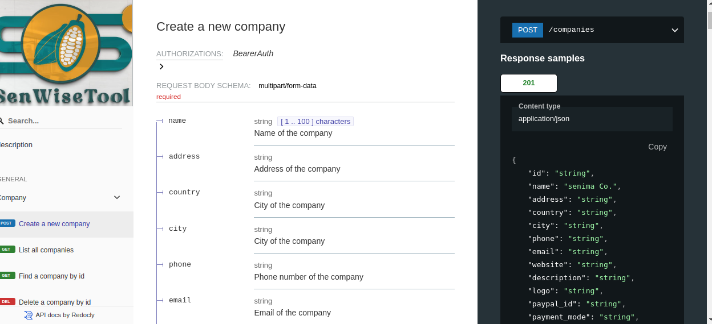

# SenWiseTool API Specification




[](https://spec.openapis.org/oas/v3.1.0)
[](https://opensource.org/licenses/Apache-2.0)
[](https://nodejs.org/)
[](https://redocly.com/)

> Comprehensive OpenAPI 3.1.0 specification for SenWiseTool - A modern cocoa industry management platform

## 🌟 Overview

SenWiseTool is a comprehensive **API specification** designed for managing cocoa industry operations, including farmer management, farm tracking, certification compliance, and supply chain optimization. This specification serves as the contract between frontend and backend teams, ensuring consistent development and integration.

> **Note**: This is an API specification project. The actual API implementation is in development. You can use this specification to understand the API design and generate client libraries.

### 🎯 Key Features

- **Farmer Management**: Complete farmer profiles, contracts, and relationship tracking
- **Farm Operations**: GPS coordinates, inspection data, and compliance monitoring
- **Certification Support**: Rainforest Alliance compliance tracking and audit trails
- **Supply Chain**: Market management, transactions, and inventory tracking
- **Training & Education**: Session management and participant tracking
- **Analytics & Reporting**: Comprehensive data insights and business intelligence

### 🏗️ Architecture Highlights

- **OpenAPI 3.1.0** specification with modern features
- **JWT Bearer Token** authentication with OAuth 2.0 support
- **RESTful API** design with consistent patterns
- **Comprehensive error handling** with standardized responses
- **Rate limiting** and security best practices
- **Multi-environment** support (dev, staging, production)

## 🚀 Quick Start

### Prerequisites

- Node.js 18+ 
- npm 8+

### Installation

```bash
# Clone the repository
git clone https://github.com/frckbrice/senwisetool-api_spec.git
cd senwisetool-api_spec/project-api_spec

# Install dependencies
npm install

# Start development server
npm run docs:serve

# Or use Docker
docker build -t senwisetool-api-docs .
docker run -p 8080:8080 -v $(pwd):/app senwisetool-api-docs
```

### Available Scripts

```bash
# Development
npm run preview          # Preview documentation locally
npm run docs:serve       # Serve documentation on port 8080
npm run docs:build       # Build static documentation

# Quality Assurance
npm run lint             # Lint OpenAPI specification
npm run lint:fix         # Fix linting issues automatically
npm run validate         # Validate specification
npm run test             # Run all quality checks

# Build & Generate
npm run bundle           # Bundle specification into single file
npm run bundle-deref     # Bundle with dereferenced schemas
npm run generate:client  # Generate TypeScript client
npm run generate:postman # Generate Postman collection

# Maintenance
npm run clean            # Clean generated files
npm run prepare          # Prepare for publishing
```

## 📚 Documentation

### Interactive Documentation

- **Local Development**: `http://localhost:8080`
- **Docker**: `http://localhost:8080` (via Docker)
- **Vercel**: [https://senwisetool-api-docs.vercel.app](https://senwisetool-api-docs.vercel.app) *(Coming Soon)*
- **GitHub Pages**: [https://frckbrice.github.io/senwisetool-api_spec](https://github.com/frckbrice/project-api_spec) 

### API Reference

| Environment | URL | Status |
|-------------|-----|--------|
| Specification | `./swt_api_spec/senwisetool.yaml` | ✅ Available |
| Local Preview | `http://localhost:8080` | ✅ Available |

### Authentication Examples

```bash
# JWT Bearer Token (when API is deployed)
curl -H "Authorization: Bearer YOUR_JWT_TOKEN" \
     https://api.senwisetool.com/v1/farms


## 🏛️ Project Structure

```
project-api_spec/
├── swt_api_spec/
│   ├── components/
│   │   ├── schemas/          # Data models and schemas
│   │   ├── responses/        # Reusable response definitions
│   │   └── parameters/       # Common parameter definitions
│   ├── paths/               # API endpoint definitions
│   │   ├── farm/            # Farm management endpoints
│   │   ├── user/            # User management endpoints
│   │   ├── company/         # Company management endpoints
│   │   └── ...              # Other domain endpoints
│   └── senwisetool.yaml     # Main OpenAPI specification
├── docs/                    # Generated documentation
├── dist/                    # Bundled specifications
├── generated/               # Generated client libraries
├── redocly.yaml            # Redocly configuration
├── Dockerfile              # Docker configuration
├── vercel.json             # Vercel deployment configuration
└── package.json            # Project dependencies and scripts
```

## 🐳 Docker Support

### Development with Docker

```bash
# Build and run documentation server
docker build -t senwisetool-api-docs .
docker run -p 8080:8080 -v $(pwd):/app senwisetool-api-docs

# Or run in detached mode
docker run -d -p 8080:8080 -v $(pwd):/app --name api-docs senwisetool-api-docs
```

### What Docker Provides

- **Consistent Environment**: Same setup across all machines
- **Easy Setup**: No need to install Node.js or dependencies locally
- **Isolation**: Clean environment for development
- **Portability**: Works the same way everywhere

### Why No Docker Compose?

Since we only have **one service** (documentation server), Docker Compose would be overkill. Direct Docker commands are simpler and more appropriate.

### Why No Database?

This is an **API specification project**, not a live API implementation. We only need:
- **Documentation server** (Redocly)
- **Static files** (OpenAPI spec, generated docs)
- **Development tools** (linting, validation)

Databases (PostgreSQL, Redis) are only needed when implementing the actual API backend.

## 🔧 Development

### Adding New Endpoints

1. Create endpoint file in appropriate directory under `paths/`
2. Define schema in `components/schemas/` if needed
3. Add path reference to main `senwisetool.yaml`
4. Run `npm run lint` to validate
5. Update documentation with examples

### Example: Adding Farm Inspection Endpoint

```yaml
# paths/farm/farm_{id}_inspection.yaml
get:
  tags:
    - Farms
  summary: Get farm inspection data
  description: Retrieve inspection data for a specific farm
  operationId: getFarmInspection
  parameters:
    - name: id
      in: path
      required: true
      schema:
        type: string
        format: cuid
  responses:
    "200":
      description: Farm inspection data retrieved successfully
      content:
        application/json:
          schema:
            $ref: "../../components/schemas/inspection_data.yaml"
```

### Code Generation

```bash
# Generate TypeScript client
npm run generate:client

# Generate Postman collection
npm run generate:postman

# Generate Python client
npx @openapitools/openapi-generator-cli generate \
  -i ./dist/senwisetool-api.yaml \
  -g python \
  -o ./generated/python
```

## 🧪 Testing

### API Testing

```bash
# Validate specification
npm run validate

# Lint specification
npm run lint

# Run all tests
npm run test
```

### Integration Testing

```bash
# Test with generated client
cd generated/typescript
npm install
npm test
```

## 📊 Project Status

### ✅ Available Now
- **API Specification**: Complete OpenAPI 3.1.0 specification
- **Documentation**: Interactive documentation with Redocly
- **Code Generation**: Client libraries for multiple languages
- **Testing Tools**: Postman collection and validation scripts
- **Development Tools**: Docker support and CI/CD pipeline

### 🚧 In Development
- **Backend Implementation**: Actual API server
- **SDK Libraries**: Official client libraries

### 📈 Specification Statistics
- **Total Endpoints**: 50+
- **Data Models**: 25+
- **Authentication Methods**: 3 (JWT, API Key)
- **Response Codes**: 15+ standardized responses

## 🔒 Security

### Authentication Methods

1. **JWT Bearer Token** (Primary)
   - 24-hour expiration
   - Refresh token support
   - Role-based access control

2. **API Key** (Service-to-Service -- WIP)
   - Webhook authentication
   - Automated integrations
   - Rate limiting per key


### Security Features

- HTTPS enforcement
- Rate limiting
- Input validation
- SQL injection prevention
- XSS protection
- CORS configuration

## 🌍 Industry Standards

This API specification follows industry best practices:

- **OpenAPI 3.1.0** - Latest specification version
- **RESTful Design** - Resource-oriented architecture
- **JSON:API** - Consistent response formatting
- **HTTP Status Codes** - Standard HTTP semantics
- **Pagination** - Offset-based pagination
- **Error Handling** - Standardized error responses
- **Versioning** - URL-based versioning strategy

## 🤝 Contributing

### Development Workflow

1. Fork the repository
2. Create feature branch (`git checkout -b feature/amazing-feature`)
3. Make changes and run tests (`npm run test`)
4. Commit changes (`git commit -m 'Add amazing feature'`)
5. Push to branch (`git push origin feature/amazing-feature`)
6. Open Pull Request

### Code Standards

- Follow OpenAPI 3.1.0 specification
- Use consistent naming conventions
- Include comprehensive examples
- Add proper descriptions
- Maintain backward compatibility

## 👨‍💻 Developer

### Portfolio & Links
- **Portfolio**: [https://maebrieporfolio.vercel.app](https://maebrieporfolio.vercel.app)
- **GitHub**: [https://github.com/frckbrice](https://github.com/frckbrice)
- **LinkedIn**: [https://linkedin.com/company/avombrice](https://linkedin.com/company/avombrice)


## 📞 Support

### Community
- **GitHub Issues**: [https://github.com/senwisetool/api-specification/issues](https://github.com/senwisetool/api-specification/issues)

> **Note**: Since this is an API specification project, the actual API endpoints are not yet deployed. You can use the specification to understand the API design, generate client libraries, and contribute to the development process.

## 📄 License

This project is licensed under the Apache License 2.0 - see the [LICENSE](LICENSE) file for details.

## 🙏 Acknowledgments

- [OpenAPI Initiative](https://www.openapis.org/) for the specification standard
- [Redocly](https://redocly.com/) for the excellent documentation tools
- [OpenAPI Generator](https://openapi-generator.tech/) for client generation
- The cocoa industry community for domain expertise and feedback

---

**Built with ❤️ for the cocoa industry**
