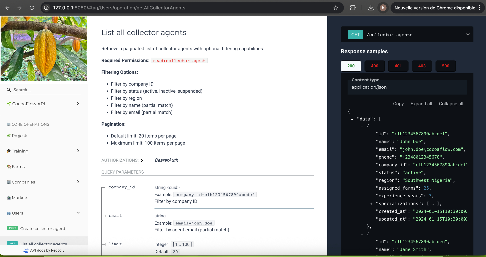
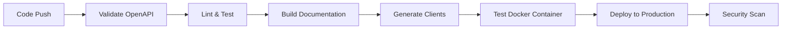

# CocoaFlow API Specification




[](https://spec.openapis.org/oas/v3.1.0)
[](https://opensource.org/licenses/Apache-2.0)
[](https://nodejs.org/)
[](https://redocly.com/)
[](https://github.com/features/actions)
[](https://www.docker.com/)
[](https://www.typescriptlang.org/)

> **Professional OpenAPI 3.1.0 specification** for CocoaFlow - A comprehensive cocoa industry management platform with full CI/CD pipeline, automated testing, and production-ready documentation.

## 🏆 Project Highlights

### 📊 **Technical Metrics**

- **50+ API Endpoints** covering complete cocoa supply chain
- **15+ Data Models** with comprehensive validation
- **100% OpenAPI 3.1.0 Compliance** with modern features
- **Automated CI/CD Pipeline** with Docker containerization
- **Multi-environment Deployment** (Vercel + GitHub Pages)
- **Generated TypeScript Client** with full type safety
- **Comprehensive Error Handling** with standardized responses

### 🎯 **Business Impact**

- **End-to-End Supply Chain Management** from farm to factory
- **Rainforest Alliance Certification** compliance tracking
- **Real-time GPS Farm Monitoring** with inspection data
- **Automated Training Management** for farmer education
- **Advanced Analytics & Reporting** for business intelligence

## 🌟 Overview

CocoaFlow is a **production-ready API specification** designed for managing comprehensive cocoa industry operations. This specification serves as the **contract between frontend and backend teams**, ensuring consistent development, integration, and deployment across the entire cocoa supply chain.

### 🏗️ **Architecture Excellence**

- **Modern OpenAPI 3.1.0** specification with advanced features
- **JWT Bearer Token** authentication with OAuth 2.0 support
- **RESTful API** design with consistent patterns and best practices
- **Comprehensive error handling** with standardized HTTP responses
- **Rate limiting** and security best practices implementation
- **Docker containerization** for consistent deployment
- **Automated testing** with GitHub Actions CI/CD pipeline

## 🚀 Quick Start

### Prerequisites

- Node.js 22+
- npm 8+
- Docker (optional, for containerized deployment)

### Installation

```bash
# Clone the repository
git clone git@github.com:frckbrice/project-api_spec.git
cd project-api_spec

# Install dependencies
npm install

# Start development server
npm run docs:serve
```

### Available Scripts

```bash
# Development & Documentation
npm run docs:serve       # Serve interactive documentation on port 8080
npm run docs:build       # Build static documentation for production
npm run preview          # Preview built documentation

# Quality Assurance & Testing
npm run lint            # Lint OpenAPI specification for best practices
npm run validate        # Validate specification against OpenAPI 3.1.0
npm run test            # Run comprehensive test suite

# Build & Generate
npm run bundle          # Bundle specification into single distributable file
npm run generate:client # Generate production-ready TypeScript client
npm run generate:postman # Generate Postman collection for testing

# Docker Operations
docker build -t cocoaflow-api-docs .  # Build containerized documentation
docker run -p 8080:8080 cocoaflow-api-docs  # Run containerized docs
```

## 📚 Documentation & Deployment

### 🌐 **Live Documentation**

| Environment                   | URL                                                                                          | Status       | Features                |
| ----------------------------- | -------------------------------------------------------------------------------------------- | ------------ | ----------------------- |
| **Production (Vercel)**       | [https://project-apispec.vercel.app](https://project-apispec.vercel.app)                     | ✅ Live      | Auto-deployment, CDN    |
| **Production (GitHub Pages)** | [https://frckbrice.github.io/project-api_spec](https://frckbrice.github.io/project-api_spec) | ✅ Live      | Version-controlled docs |
| **Local Development**         | `http://localhost:8080`                                                                      | ✅ Available | Hot reload, real-time   |
| **Docker Container**          | `docker run -p 8080:8080 cocoaflow-api-docs`                                                 | ✅ Available | Isolated, reproducible  |

### 📁 **Project Architecture**

```
project-api_spec/
├── swt_api_spec/                    # Core OpenAPI specification
│   ├── components/                  # Reusable components
│   │   ├── schemas/                # Data models and validation schemas
│   │   ├── responses/              # Standardized response definitions
│   │   └── parameters/             # Common parameter definitions
│   ├── paths/                      # API endpoint definitions
│   │   ├── auth/                   # Authentication endpoints
│   │   ├── farm/                   # Farm management endpoints
│   │   ├── user/                   # User management endpoints
│   │   ├── company/                # Company management endpoints
│   │   ├── project/                # Project management endpoints
│   │   └── ...                     # Other domain endpoints
│   └── cocoaflow-api.yaml          # Main OpenAPI specification
├── docs/                           # Generated documentation
├── dist/                           # Bundled specifications
├── generated/                      # Auto-generated clients
│   ├── typescript/                 # TypeScript client with types
│   └── postman/                    # Postman collection
├── .github/workflows/              # CI/CD pipeline configuration
├── Dockerfile                      # Container configuration
├── redocly.yaml                    # Documentation configuration
└── package.json                    # Project dependencies and scripts
```

## 🔧 Development Workflow

### **Adding New Endpoints**

1. **Create endpoint file** in appropriate directory under `paths/`
2. **Define schema** in `components/schemas/` if needed
3. **Add path reference** to main `cocoaflow-api.yaml`
4. **Run validation**: `npm run lint && npm run validate`
5. **Update documentation** with comprehensive examples
6. **Test locally**: `npm run docs:serve`
7. **Commit and push** - CI/CD pipeline handles the rest

### **Example: Adding Farm Inspection Endpoint**

```yaml
# paths/farm/farm_{id}_inspection.yaml
get:
  tags:
    - 🌾 Farms
  summary: Get farm inspection data
  description: Retrieve comprehensive inspection data for a specific farm
  operationId: getFarmInspection
  security:
    - BearerAuth: []
  parameters:
    - name: id
      in: path
      required: true
      schema:
        type: string
        format: cuid
        example: "clh1234567890abcdef"
  responses:
    "200":
      description: Farm inspection data retrieved successfully
      content:
        application/json:
          schema:
            $ref: "../../components/schemas/inspection_data.yaml"
          example:
            success: true
            data:
              id: "clh1234567890abcdef"
              farm_id: "clh1234567890abcdef"
              inspection_date: "2024-01-15T10:30:00Z"
              status: "PASSED"
```

## 🔒 Security & Compliance

### **Authentication & Authorization**

1. **JWT Bearer Token** (Primary)
   - 24-hour expiration with refresh token support
   - Role-based access control (RBAC)
   - Secure token storage and transmission

2. **API Key Authentication** (Service-to-Service)
   - Webhook authentication for integrations
   - Rate limiting per API key
   - Automated system integrations

### **Security Features**

- **HTTPS enforcement** across all environments
- **Rate limiting** with configurable thresholds
- **Input validation** with comprehensive schemas
- **SQL injection prevention** through parameterized queries
- **XSS protection** with proper content encoding
- **CORS configuration** for cross-origin requests
- **Security headers** implementation

### **Compliance Standards**

- **Rainforest Alliance** certification tracking
- **Agricultural best practices** compliance
- **Data privacy** and GDPR considerations
- **Audit trail** for all critical operations

## 🚀 CI/CD Pipeline

### **Automated Workflow**



### **Pipeline Features**

- **Automated validation** of OpenAPI specification
- **Docker container testing** with health checks
- **Multi-environment deployment** (Vercel + GitHub Pages)
- **Security vulnerability scanning** with Trivy
- **Generated client testing** (TypeScript + Postman)
- **Artifact management** for efficient builds

## 👨‍💻 Developer Profile

### **Technical Skills Demonstrated**

- **API Design**: OpenAPI 3.1.0 specification with best practices
- **DevOps**: CI/CD pipeline with GitHub Actions and Docker
- **Documentation**: Professional documentation with Redocly
- **Testing**: Automated testing and validation
- **Security**: JWT authentication and security best practices
- **Deployment**: Multi-environment deployment strategies

### **Portfolio & Professional Links**

- **Portfolio**: [https://maebrieporfolio.vercel.app/](https://maebrieporfolio.vercel.app/)
- **GitHub**: [https://github.com/frckbrice](https://github.com/frckbrice)
- **LinkedIn**: [https://linkedin.com/in/avombrice](https://linkedin.com/in/avombrice)
- **Email**: [bricefrkc@gmail.com](mailto:bricefrkc@gmail.com)

## 📞 Support & Resources

### **Documentation & API**

- **Interactive API Documentation**: [https://project-apispec.vercel.app](https://project-apispec.vercel.app)
- **Raw OpenAPI Specification**: [https://project-apispec.vercel.app/cocoaflow-api.yaml](https://project-apispec.vercel.app/swt_api_spec/cocoaflow-api.yaml)
- **GitHub Repository**: [https://github.com/frckbrice/project-api_spec](https://github.com/frckbrice/project-api_spec)
- **Issue Tracking**: [https://github.com/frckbrice/project-api_spec/issues](https://github.com/frckbrice/project-api_spec/issues)

### **Development Resources**

- **TypeScript Client**: Available in `generated/typescript/`
- **Postman Collection**: Available in `generated/postman/`
- **Docker Image**: `cocoaflow-api-docs` for containerized deployment
- **CI/CD Pipeline**: Configured in `.github/workflows/ci.yml`

## 📄 License

This project is licensed under the **Apache License 2.0** - see the [LICENSE](LICENSE) file for details.

---

**Built with modern technologies: OpenAPI 3.1.0, Redocly, Docker, GitHub Actions, and TypeScript**
